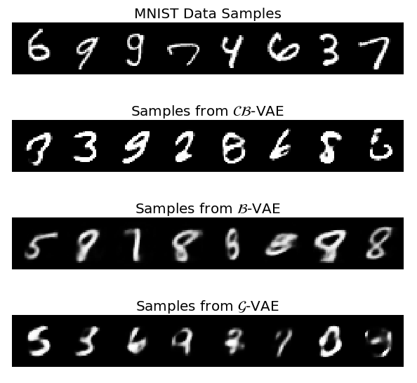

# Continuous-Bernoulli-VAE

We aim to replicate the experiments described in the paper ["The continuous Bernoulli: fixing a pervasive error in variational autoencoders"](https://openreview.net/forum?id=HyxViBSgLB) from the NeurIPS 2019 submissions, as part of our participation in the  [Reproducibility Challenge @ NeurIPS 2019](https://reproducibility-challenge.github.io/neurips2019/).

## Table of contents

- [Description](#description)
- [Authors](#authors)
- [Results](#results)
- [Usage](#usage)
- [References](#references)
- [License](#license)

## Description 

We replicate the results of the recent paper *The continuous Bernoulli: fixing a pervasive error in variational autoencoders* and extend the results to new experiments, as well as related approaches.

## Authors

 - [Robert Aduviri](https://robert-alonso.github.io/)
 - [Alfredo de la Fuente](https://alfo5123.github.io/)

## Results

**Qualitative constrast between Bernoulli VAE and Continuous Bernoulli VAE**
<div align="center">
 
</div>

## Usage

### Setup

>Requires Python 3.6 or higher.

The following lines will clone the repository and install all the required dependencies.

```
$ git clone https://github.com/Robert-Alonso/Continuous-Bernoulli-VAE.git
$ cd Continuous-Bernoulli-VAE
$ pip install -r requirements.txt
```

### Pretrained Models

We stored the checkpoints of the trained models in the **trained_models** folder. 

### Train models 

Fill


## References
Papers:
- **[The continuous Bernoulli: fixing a pervasive error in variational autoencoders](https://arxiv.org/pdf/1907.06845.pdf) (with [Appendix](https://arxiv.org/src/1907.06845v4/anc/cont_bern_aux.pdf))**
- [An Introduction to Variational Autoencoders](https://arxiv.org/pdf/1906.02691.pdf)
- [Tutorial on Variational Autoencoders](https://arxiv.org/abs/1606.05908)

Repositories: 
- [PyTorch Official VAE Implementation](https://github.com/pytorch/examples/tree/master/vae)
- [VAE-pytorch](https://github.com/atinghosh/VAE-pytorch)
- [inception-score-pytorch](https://github.com/sbarratt/inception-score-pytorch)

## License

[MIT License](https://github.com/Robert-Alonso/Continuous-Bernoulli-VAE/blob/master/LICENSE)
